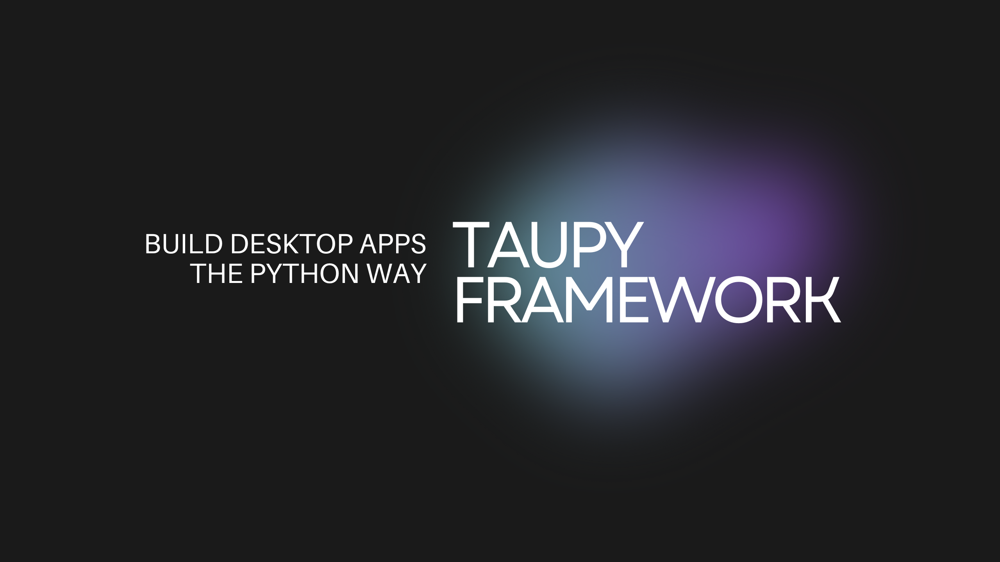

<p align="center">
  
</p>

<p align="center">
  
  
  
  
  
  
  
</p>

---

## ⚡ What is TauPy?

**TauPy** is a modern desktop framework for Python.  
It allows you to build **native-feeling desktop apps** using:

- Python
- HTML-like widgets (UI)
- Built-in State system (React-style reactivity)
- Built-in WebSocket engine
- Auto-updating UI on state changes
- Powerful layout system (HStack / VStack / Container)
- DaisyUI + Tailwind built-in themes
- Routing system like Flask / FastAPI
- Zero JavaScript required

Everything renders instantly - TauPy is engineered for **extreme performance** and future scalability.

---

## 🚀 Why TauPy?

- **Insanely fast UI updates**  
  State changes propagate instantly to the UI via a WebSocket engine.

- **Minimalistic API**  
  Build complex apps with very little code.

- **Cross-component reactivity**  
  Like React, but 100% Python.

- **Desktop window launcher**  
  Powered by compiled Rust WebView2 runtime.

---

## ✨ Quick Start Example

Your first TauPy app (only **8 lines** of logic):

```python
from TauPy import App, VStack, Text, Button, State
from TauPy.events import Click

app = App("Hello TauPy", 600, 400)
msg = State("Hello, TauPy!")

@app.dispatcher.on_click("btn_hello")
async def hello(_: Click):
    msg.set("Button clicked!")

@app.route("/")
def home():
    return VStack(
        Text(msg),
        Button("Click me", id="btn_hello"),
    )

app.run(VStack(id="main"))

```

Run it:
```bash
taupy dev
```

Instant window. Instant reactivity. Zero delays.


## 🛠 TauPy CLI

TauPy includes an official CLI.

Create project

```bash
taupy new myapp
```

```bash
cd myapp
taupy dev
```

Build for distribution
```bash
taupy build
```

## 🧭 Routing

TauPy supports simple, very Pythonic routing:

```python
@app.route("/settings")
def settings():
    return Text("Settings page")
```

## 🧪 State System

```python
count = State(0)

@app.dispatcher.on_click("inc")
async def inc(_):
    count.set(count() + 1)
```

Auto-updates any <Text(lambda)> bound to this state.

## 🎨 Themes (DaisyUI x Tailwind)

TauPy ships with all DaisyUI themes.

```python
await app.set_theme("synthwave")
```

Themes apply instantly.

# 📅 Roadmap

## ✔️ Completed
- 🟩 **Routing**
- 🟩 **State management**
- 🟩 **Event system** (click / input)
- 🟩 **WebSocket engine**
- 🟩 **Automatic UI refresh**
- 🟩 **Layout components** (HStack, VStack, Container…)
- 🟩 **Custom components** (HTML Templates)
- 🟩 **CLI**
- 🟩 **Rust WebView2 launcher**
- 🟩 **Theme switching** (DaisyUI)
- 🟩 **Hot Reload**

---

## 🚧 In Progress
- 🟨 **Native dialogs** (Open File / Save File / Message Box)
- 🟨 **Window API** (resize, fullscreen, minimize, position)
- 🟨 **Background tasks**
- 🟨 **Persistent storage** (local DB)
- 🟨 **Animations & transitions**
- 🟨 **DevTools inspector mode**
- 🟨 **Widget playground** (browser-based)
- 🟨 **Built-in icons library**

---

## 🔜 Coming Soon
- 🟦 **Cross-platform launcher** (Linux, macOS)
- 🟦 **File-system bridge**
- 🟦 **App packaging** (one-file executable)
- 🟦 **Custom themes API**
- 🟦 **Modal & Toast widgets**
- 🟦 **Networking helpers** (HTTP/WebSocket client)

---

## 🧭 Future Ideas
- 🟪 **Gesture support** (touchscreens)
- 🟪 **Drag & drop API**
- 🟪 **Native notifications**
- 🟪 **GPU-accelerated components**
- 🟪 **Plugins ecosystem**
- 🟪 **Visual UI builder**

# 📜 License

TauPy is released under the MIT License.
Free for commercial and personal use.

# 💬 Contributing

Contributions are welcome!

# ⭐ Support the Project

If TauPy inspires you - please star the repository.
Every ⭐ makes development faster ❤️