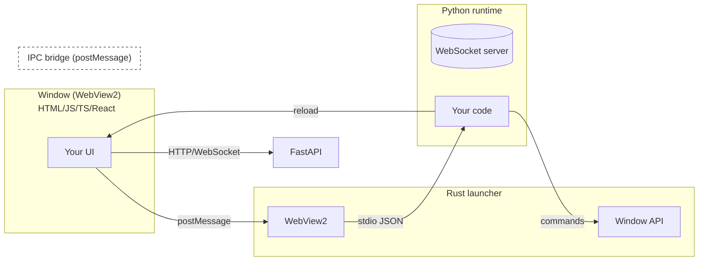

# How It Works

TauPy glues **Python**, **Rust** and modern **web technologies** into a single runtime that feels native to desktop developers and familiar to web developers.

> **One sentence:**  
> A tiny Rust launcher opens a WebView2 window that renders an HTML UI; Python code controls everything through an async RPC bridge and hot-reloads in development.

---

## Birds-eye view



1. **Rust launcher** (≈8 MB) creates a native window via Win32 APIs and hosts [WebView2].
2. On startup it runs your **Python backend** (either as `python -m taupy.run` in dev or as an embedded interpreter in production).
3. The backend opens a **tiny HTTP+WebSocket server** (based on `tiny_http` + `websockets`) on an ephemeral port and serves:
   - HTML generated from Python widgets **or** static files from the React/Vite `dist/` folder.
   - A WebSocket endpoint for reactive state updates.
4. The launcher loads the page in WebView2 pointing at that port.
5. **UI events** (button clicks, keyboard, drag) are sent to Python through WebSocket; Python mutates state and pushes incremental HTML patches back (morph-dom style) → immediate update on screen.
6. **Window & OS integrations** (resize, drag, system tray, dialogs) are sent from Python to Rust via **stdin/stdout JSON IPC**. The launcher performs the native operation and can report events back the same way.

---

## Development vs Production

| Mode | How it serves assets | Reload strategy | Packaging |
|------|---------------------|-----------------|-----------|
| **Dev (taupy dev)** | Python widgets: generated HTML; React template: external Vite dev server (`localhost:5173`) | File-watcher restarts Python; WebSocket pushes patch diffs; window auto-reloads | - |
| **Build (taupy build)** | Widgets: pre-rendered HTML; React: static `dist/` served by Python | No live reload | Nuitka one-file EXE + embedded launcher |

---

## Communication channels

### 1. HTTP & WebSocket (Python ⇄ Frontend)

TauPy’s backend exposes a tiny built-in HTTP endpoint (root `/`) and a dedicated `/ws` WebSocket used for state updates. **All real-time UI → backend → UI communication flows through the `/ws` WebSocket channel** - events such as clicks or keystrokes travel to Python, and state diff patches stream back to the browser. Standard HTTP is used mainly for the initial HTML/JS payload (and any additional REST endpoints you expose). Because WebView2 is essentially Chromium, everything behaves like a normal SPA.

### 2. StdIO IPC (Python ⇄ Launcher)

Rust and Python processes talk via newline-delimited JSON on `stdin`/`stdout` - simple, cross-platform and debugger-friendly. Messages include:

```jsonc
{ "type": "set_title", "title": "My App" }
{ "type": "toggle_fullscreen" }
{ "type": "log", "level": "info", "msg": "Window resized to 1280×800" }
```

Python can send any command described in `taupy.app.App.send_window_command()`, and receives events such as close requests or monitor-info changes.

---

## Runtime packages

| Component | Implementation | Purpose |
|-----------|----------------|---------|
| `taupy` (PyPI) | Pure Python | Widgets, state, routing, CLI, ASGI server, packager |
| `taupy-launcher` | Rust + C++ (WebView2) | Native window, IPC, HTML loader |
| `pywebview` | Python → CEF/WebView2 bridge | Optional fallback (planned) |

---

## Performance profile

* **Startup:** ~90 ms cold start for Python UI; React adds asset load time (~150 ms for hello-world bundle).
* **Memory:** 40–60 MB RSS typical for Python UI; add Chromium (≈90 MB) for complex UIs.
* **Incremental render:** HTML diffs are streamed; average patch size <2 kB ⇒ sub-50 ms UI refresh on medium apps.

---

## Trade-offs

| ✔ Pros | ✘ Cons |
|--------|--------|
| Python productivity | Windows-only today (macOS/Linux WIP) |
| Near-zero boilerplate | Larger footprint than Qt/GTK for tiny tools |
| React & NPM optional | WebView2 required on end-user machine |
| Hot reload & state diffing | Young project: API may evolve |

---

## Next steps

* Read [Quick Start](./quickstart.md) to build your first app.
* Study [Python UI](./python-ui/overview.md) to craft components & state.
* Explore [React Frontend](./react.md) if you prefer JSX/TSX.
* Check [Build & Distribution](./build.md) to ship your app.

[WebView2]: https://learn.microsoft.com/microsoft-edge/webview2