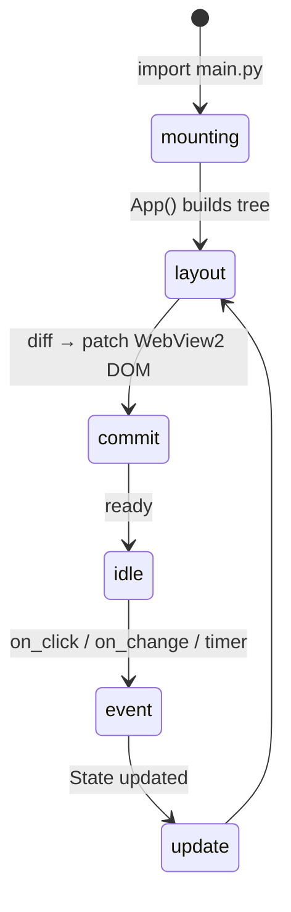

# Python UI Overview

TauPy lets you build **fully-featured desktop user interfaces in pure Python**-no HTML or JavaScript required while keeping the developer experience as smooth as React or SwiftUI. This page introduces the main concepts, architecture, and core widgets.

---

## 1. Core ideas

| Concept | What it means |
|---------|---------------|
| Declarative UI | You describe the interface as a tree of widgets returned from an `App()` function. |
| Reactive state | Any `State[T]` object stores a value and automatically triggers a re-render of every widget that reads it when the value changes. |
| Single process | Both logic and rendering run in the same Python process; IPC with the WebView2 layer is handled for you. |
| Hot reload | When running `taupy dev`, the widget tree is rebuilt on-the-fly whenever you save the file. |

---

## 2. Minimal example

```python
from taupy.ui import App, VStack, Button, Text
from taupy.state import State
import asyncio

counter = State(0)

async def increment():
    await asyncio.sleep(0.1)
    counter.value += 1

def app():
    return App(
        VStack(
            Text(f"Clicked {counter.value} times"),
            Button("Click me", on_click=increment),
        )
    )
```

Save this as `main.py`, run `taupy dev`, and a desktop window with a button will appear. Every click updates `counter` and the text re-renders instantly.

---

## 3. Application lifecycle



* **mounting** – the first render after the module is imported.  
* **update** – any change to `State` or `Ref` values schedules another layout pass for the affected subtree.

---

## 4. State management

```python
from taupy.state import State
name = State("Alice")

@effect
def greet():
    print("Hello", name.value)
```

* `state.value` gives you the current value.  
* Assigning to `state.value` marks the state as changed and triggers a re-render.  
* `State(...)` turns any Python value into a reactive container.

### DerivedState
For computed values, use `DerivedState(fn, deps=[state1, state2])`.

---

## 5. Widget categories

### Layout containers
* `VStack`, `HStack` – vertical / horizontal stacking.
* `Grid(cols, rows, gap)` – CSS Grid under the hood.
* `Scroll` – makes its children scrollable.

### Input controls
* `Button(text, on_click=...)`
* `TextInput(value: State[str])`
* `Checkbox(value: State[bool])`
* `Slider(value: State[int], min=0, max=100)`

### Data display
* `Text(content, variant="body|title|code")`
* `Image(src, width, height)`
* `Table(columns, rows)`

See the **API Reference** for the full list.

---

## 6. Styling & theming

Every widget accepts a `style=Style(...)` argument where you can set `padding`, `gap`, `color`, `bg`, `border_radius`, and more.  
The style is converted to CSS-like properties and inlined into the DOM automatically.

---

## 7. Async handlers

TauPy doesn’t block the event loop-handlers can be declared with `async def`.  
Await long-running tasks (HTTP calls, database queries) and update `State` when they finish.

```python
from taupy.ui import Button
from taupy.state import State
import httpx

joke = State("…")

async def load_joke():
    resp = await httpx.get("https://icanhazdadjoke.com/", headers={"Accept": "text/plain"})
    joke.value = resp.text

Button("Another joke", on_click=load_joke)
```

---

## 8. Python UI vs. React template

| | Python UI | React UI |
|--|-----------|----------|
| UI language | Pure Python | JSX / TSX |
| Hot reload | `watchdog` (backend restart) | Vite HMR |
| Bundle size | A few MB (dist + launcher) | Tens / hundreds of KB JS |
| Native widgets | Rendered via WebView2 (HTML) | Same |
| Complex layouts | Built-in (`Grid`, `Flex`) | Depends on CSS |

CLI commands are identical; the main differences are project structure and the need for `npm` in React projects.

---

## 9. Best practices
1. Keep state close to where it’s used.  
2. Don’t store large binary data in `State`; cache or stream it instead.  
3. Break complex UIs into small component functions.  
4. Use [`taupy.routing`](../routing.md) for multi-page apps.  
5. Avoid blocking the event loop; run heavy tasks in threads or processes.

---

## 10. Next steps
* Walk through the [Quick Start](../quickstart.md).  
* Dive into the [API Reference](./api.md) for widget details.  
* Explore practical examples in the `examples/` folder.

Armed with these concepts, you’re ready to build rich desktop UIs using nothing but Python!